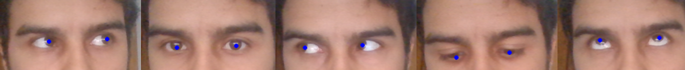

# Pupil Finder

This project implements an CNN and trains it to predict the pupil position in an image.




## Getting started

These instructions will get you a copy of the project up and running on your local machine for development and testing purposes.

### Prerequisites

Ensure you have `Python 3.7` and `git` installed. TensorFlow currently does not support `Python 3.8`.

### Installation

Clone this repository:
```
$ git clone https://github.com/nahueespinosa/pupil_finder.git
```

Install requirements:
```
$ pip3 install -r requirements.txt
```

If you want to train your own models download the dataset and extract it in the repository.
More information can be obtained [here](https://github.com/nahueespinosa/pupil_finder/tree/master/dataset).

### Usage

To train a neural network use this command:
```
$ python main.py -h
usage: main.py [-h] [-v] [-l LIMIT] [-s] filename

Train a CNN to identify pupil position.

positional arguments:
  filename             name of the output file (use *.h5 for HDF5 format)

optional arguments:
  -h, --help           show this help message and exit
  -v, --verbose        increase verbosity level
  -l LIMIT             limit the number of images to load
  -s, --show-database  show database images before processing
```

To test a trained model with a camera you can use this script:
```
$ python test_model.py -h
usage: test_model.py [-h] filename

Test CNN to predict pupil position using a camera.

positional arguments:
  filename    name of the input model file

optional arguments:
  -h, --help  show this help message and exit
```

## Configuration

Logging and training parameters can be configured modifying the file `configuration.yml`.

```python
training:
  img_width: 64
  img_height: 64
  epochs: 50
  test_size: 0.4
```

## Acknowledgements

The dataset was obtained [here](http://mrl.cs.vsb.cz/eyedataset) from the Media Research Lab (MRL) at the
 Department of Computer Science, Faculty of Electrical Engineering and Computer Science, VSB - Technical University
 of Ostrava.